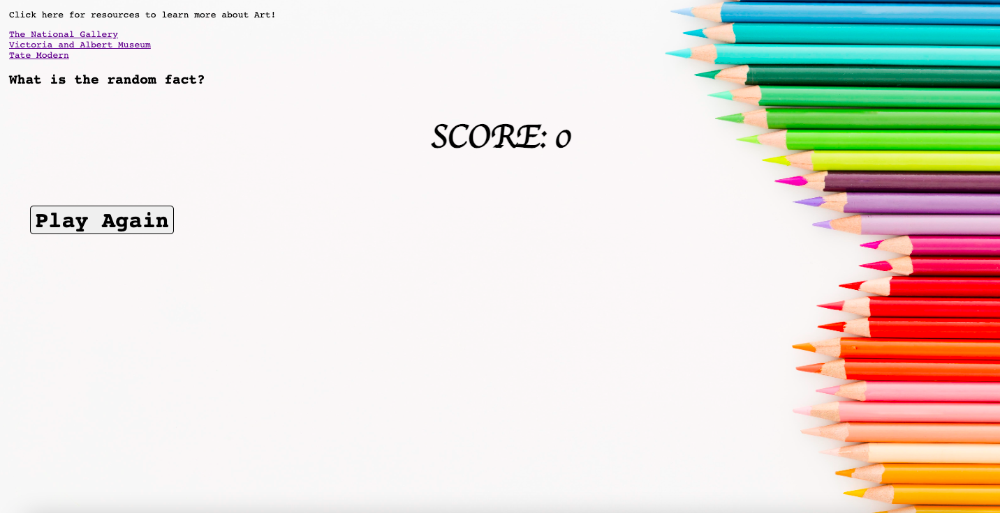

# Image Gang

## Installation and usage:

### Server

 `cd` into `server` directory:  
 - `npm i`
- `npm start` or
`npm run dev`

### Client

- on `client` directory: Use "Open With Live Server" option in VS Code in order to load webpage on default browser

### Technologies:

- This project makes use of various technologies, including the following:  
  - JavaScript
  - HTML, CSS
  - Express API  
  - Node  
  - Git  
  - GitHub  
  

### License: 
Please refer to LICENSE.txt file in client directory for relevant project license.

### Screenshots:

- Please refer to below images for visual example of project webpage in use;

### Contribution Guide:

- João Patacas -- JavaScript (client side, server side) contributions for question pages, scorepages, inital project setup
- Angela Demiri -- HTML, CSS contributions for scorepage; Random fact API crafting
- Francesca Adu -- HTML, CSS contributions for scorepage; Question and answer API crafting
- George Hill -- HTML, CSS, JavaScript (client side) contributions for question pages
- Tobi Akinola -- HTML, CSS contributions for question pages, README.md, license

### Future Features:

- Displaying of current score throughout the quiz.
- Visual message after answering a question to notify whether chosen answer is correct or incorrect.
- Expanding the webpage to include similar quiz games for other subject areas, namely music and english topics
