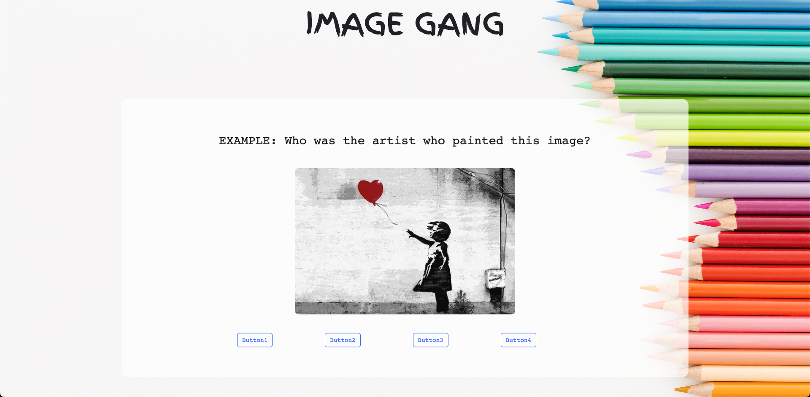

Project Title: Image Gang - The Picture Quiz

// Project Description:

- This project entails a picture-based quiz game playable online, where the user views provided images
  and answers questions that are based around the topic of the provided pictures.
- Final version of the game is expected to have 3 different picture quiz games based on 3 different non-STEM subjects, namely art, music and english.
- This early version of the code, however, focuses on building a functional version of the art game only.
  Questions range from naming the responsible artist for painting displayed, when painting was completed, etc
- User will accumulate points for every correct answer and, after 10 rounds, will be directed to scorepage where final score will
  be displayed.
- Scorepage will also display random knowledgable facts about the subject for further educational value.

// Installation and usage:

- Run `npm i express` in order to make use express API.
- Run `npm i nodemon` for dynamic refresh of webpage with saving.
- Install live server extension in VSCode.
- Run `npm run dev` or `npm start`.
- Right click and click "Open With Live Server" in order to load webpage on default browser

// Technologies:

- This project make use of various technologies, including the following:
  -- JavaScript
  -- Express API
  -- Node
  -- Git
  -- GitHub
  -- HTML, CSS

// Process:

// License: Please refer to LICENSE.txt file in client directory for relevant project license.

// Screenshots:

- Please refer to below images for visual example of project webpage in use;

// Wins and Challenges:

// Badges:

// Contribution Guide:

- Joao Patacas -- JavaScript (client side, server side) contributions for question pages, scorepages
- Angela Demiri -- HTML, CSS contributions for scorepage; Random fact API crafting
- Francesca Adu -- HTML, CSS contributions for scorepage; Question and answer API crafting
- George Hill -- HTML, CSS, JavaScript (client side) contributions for question pages
- Tobi Akinola -- HTML, CSS contributions for question pages

// Future Features:

- Displaying of current score throughout the quiz.
- Visual message after answering a question to notify whether chosen answer is correct or incorrect.
- Expanding the webpage to include similar quiz games for other subject areas, namely music and english topics
